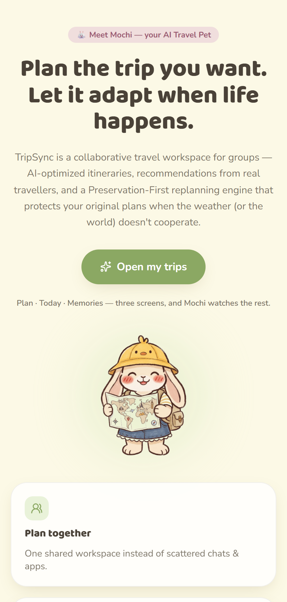

# TripSync by Three Little Bugs

**Team:** Cheong Li Hua, Yap Zhe Cheng, Chaw Yen Hua

**Problem Statement:** Travel Planner

**Video Presentation:** _[Unlisted YouTube Link, TODO]_

**Presentation Slides:** _[Public Link, TODO]_

**Live demo:** https://trip-sync-blue.vercel.app

> A collaborative travel workspace: AI-optimized itineraries, recommendations from real travellers, and a **Preservation-First replanning engine** that adapts your trip when the weather (or the world) doesn't cooperate.

---

## 1. Project Overview

### The Problem

<!-- TODO: tailor this to your actual research/interviews before submitting. -->

Group trips are planned once, on a spreadsheet or a shared doc, and then left to survive contact with reality. In practice:

- **Plans are static.** A rained-out afternoon, a delayed flight, or a closed attraction forces someone in the group to manually re-shuffle the whole itinerary, usually mid-trip and under stress.
- **Preferences conflict.** Groups mix people who want food and culture with people who want shopping and nightlife, and reconciling that by chat thread is slow and often unfair to whoever speaks up least.
- **Money tracking is an afterthought.** Expenses get paid ad hoc and "who owes who" is reconstructed from memory at the end of the trip.
- **Discovery is generic.** Recommendations come from generic listicles rather than people who've actually been.

**Stakeholders:** groups of friends/family travelling together, budget-conscious travellers who need fair cost-splitting, and trip organizers who currently absorb all the replanning effort themselves.

**Reach & scalability:** the demo trip is a 4-person Guangzhou itinerary, but nothing about the mechanism is specific to that group size or destination. The same Preservation-First engine, scoring model, and expense-splitting apply to a 2-person weekend trip or a 20-person school/corporate trip alike, since both are just "a set of saved places against a shared calendar and budget." Beyond bigger groups, the same building blocks extend to corporate travel coordination and study-tour/school-trip planning, where the "someone always ends up replanning by hand" problem is the same one, just with a different group label.

**Existing apps and where they fall short:** apps like *Wanderlog* and *TripIt* are good at consolidating bookings and building a shareable itinerary, but they treat the itinerary as a static document: if a day gets disrupted, the user still has to manually find replacements and re-slot them. None of them close the loop with automatic, preference-aware re-optimization, in-app expense settlement, and group-preference balancing in one workspace.

| | Wanderlog / TripIt | TripSync |
| --- | --- | --- |
| Itinerary after a disruption | Stays broken until a human manually fixes it | Preservation-First engine re-slots your own saved places automatically |
| Recommendations | Generic listings/reviews | AI picks + notes from real travellers who've actually been |
| Group fit | One itinerary, no per-person scoring | Plans scored per traveller (budget fit, preference match, group satisfaction, etc.) |
| Expense splitting | Separate app or spreadsheet | Built into the same workspace, with automatic settle-up |
| Cost to view | Often needs an account/app install | Read-only link, no account needed |

### Our Solution

TripSync is a collaborative trip-planning workspace that generates AI-scored itinerary options from everyone's preferences and budget, then keeps that plan alive when things change, automatically re-arranging around disruptions instead of asking a human to do it. It bundles the whole trip lifecycle (planning → discovery → in-trip adaptation → expense settlement → retrospective) into one shared space that anyone in the group can open with just a link.

**Feature set:**

- **AI-scored itinerary options** — multiple candidate plans ranked on budget fit, group satisfaction, preference match, travel efficiency, convenience, and schedule feasibility, with an in-line feedback loop to tweak and regenerate.
- **Discover** — a place browser mixing AI recommendations and real-traveller-submitted spots, with save/bookmark and the ability to add your own places into the plan.
- **Preservation-First replanning** — when a disruption is detected (e.g. rain forecast on an outdoor day), TripSync rearranges saved places first, so every place the group already committed to still gets visited, before ever suggesting something new.
- **Flight delay auto-reflow** — a changed flight time automatically reflows the remaining schedule and surfaces "bonus" activities in the time that opens up.
- **Colour Walk** — a 30-minute group mini-game the trip pet offers when a disruption leaves an unplanned gap; a colour-based photo scavenger hunt with a shape-based mode for colour-blind travellers.
- **Group preferences** — each traveller sets their own interests and pace; plans are scored against the whole group, not just the organizer.
- **Expense tracking & settle-up** — shared expenses with automatic debt simplification (who pays whom, minimizing the number of transactions).
- **Accountless sharing** — a trip link opens read-only for anyone, edit access stays with invited members, no sign-up wall for viewers.
- **Post-trip retrospective** — actual spend vs. budget, ratings, shared memories, and a learned preference profile that TripSync carries into the next trip.
- **Mochi**, the trip pet, gives lightweight emotional feedback (happy/sad/angry/aggrieved/shy/scared) throughout the flow instead of dry system notifications.

### In practice: two disruptions, zero lost plans

**Rain on Day 2.** The forecast flags heavy rain at 3 PM, right when Liwan Lake Park (outdoor) was scheduled.

| | Before | After |
| --- | --- | --- |
| Day 2 (Wed) | Chen Clan Ancestral Hall → **Liwan Lake Park** → Ah Po's Noodle House | Chen Clan Ancestral Hall → **Tianhe Sportcenter Mall** (indoor, already saved for Day 4) → Ah Po's Noodle House |
| Day 4 (Fri) | Tianhe Sportcenter Mall → Yuexiu Night Market | **Liwan Lake Park** (moved here, sunny) → Yuexiu Night Market |

Nothing was dropped and nothing new was suggested: Day 2 and Day 4 simply swapped one saved activity each, so every place the group picked still gets visited.

**A 5-hour flight delay on Day 6.** Flight CZ3456 (CAN → KUL) slips from 18:00 to 23:00.

- **Before:** 10:00 hotel checkout, 12:00 souvenirs at Canton Tower, 15:00 head to the airport, 18:00 flight departs.
- **After:** 10:00 hotel checkout, 12:00 souvenirs at Canton Tower, 18:30 🍜 bonus round at Ah Po's Noodle House, 20:00 head to the airport, 23:00 flight departs (delayed).

Result: zero missed activities, zero extra cost, and one bonus meal squeezed into the time the delay freed up.

---

## 2. Ideation & Process

### 2.1 Ideas We Considered

<!-- TODO: fill in with the ideas your team actually generated, chosen ideas first. -->

| Idea | Why it was dropped / kept |
| --- | --- |
| A (Chosen) | |
| B (Chosen) | |
| C | |

### 2.2 Ideation Boards

<!-- TODO: embed your mindmap/crazy-eights/affinity-diagram images here, 1-2 lines of context under each. -->

```md

```

### 2.3 Mentor Consultation

<!-- TODO: log each mentor session, even ones where you pushed back on the advice. -->

| Date | Mentor | Feedback Received | What Was Changed |
| --- | --- | --- | --- |
| 8/9/2026 | Janelle Tan | Mochi (the pet) is a distinctive, memorable feature that genuinely sets TripSync apart from other travel apps, and it should be treated as the product's bright spot. Rather than spreading effort across many features, the team should pick the strongest one and focus on making it shine. | We moved away from assuming that packing in more features improves our chances of winning. Instead, we refocused on sharpening Mochi as our standout, differentiating feature, and prioritized depth on the one idea that genuinely solves the problem over breadth across many. |

---

## 3. Design & Prototype

**UI Prototype:** _[Public Link, TODO, verify it opens in an incognito window]_, or try the [live demo](https://trip-sync-blue.vercel.app) directly.

| | |
| --- | --- |
|  **Welcome.** Mochi and the pitch, in one screen: plan together, let it adapt when life happens. |  **Discover.** AI picks and real-traveller recommendations side by side, filterable, saved straight into the trip. |
|  **AI-scored plans.** Three itinerary options, each transparently scored on budget fit, group satisfaction, preference match, and more. |  **Preservation-First replanning.** Rain is detected, an outdoor activity is identified, and saved places are rearranged before anything new is suggested. |
|  **Flight delay auto-reflow.** A 5-hour delay becomes a bonus noodle run instead of a scramble at the gate. |  **Colour Walk.** The disruption's free two hours become a group photo scavenger hunt, with a shape-based mode for colour-blind travellers. |
|  **Expense tracking.** Every shared cost logged, with the minimal set of settle-up transfers computed automatically. |  **Post-trip retrospective.** Actual spend vs. budget, a rating, shared memories, and a profile TripSync carries into the next trip. |

---

## 4. What Makes It Different

- **Preservation-First replanning, not regeneration.** Most planners either freeze the itinerary or throw it out and regenerate from scratch after a disruption. TripSync's replanning engine explicitly re-slots the places the group already saved before it ever suggests something new, so a rained-out afternoon doesn't cost you the attraction you actually wanted to see.
- **A disruption becomes an activity, not just a problem.** Colour Walk turns a scheduling gap (caused by weather, delay, or a cancelled slot) into a bonded group activity instead of dead time, with a shape-based mode built in for colour-blind travellers from day one.
- **Group-fair AI scoring, shown transparently.** Itinerary options are scored per-traveller-preference and shown as explicit scores (budget fit, group satisfaction, preference match, efficiency, convenience, feasibility) rather than a black-box "recommended for you."
- **The trip keeps learning.** The post-trip retrospective feeds a learned preference profile forward into future trips, instead of every trip starting from a blank slate.
- **Zero-friction sharing.** Anyone with the link can view the live trip with no account; only invited collaborators can edit.

*(See the comparison table in section 1 for how this stacks up against Wanderlog/TripIt feature-by-feature.)*

---

## 5. Technical Architecture & Feasibility

### Tech stack

| Layer | Choice | Why | Constraints |
| --- | --- | --- | --- |
| Frontend | React 19 + TypeScript, Vite | Fast dev loop, strong typing for a screen-flow-heavy prototype | None |
| Styling | Tailwind CSS v4 | Rapid iteration on a large number of screens without a component library | Needs discipline to keep design tokens consistent across screens |
| Motion | Framer Motion | Screen transitions and micro-interactions (e.g. Mochi's reactions) | Adds bundle size; used sparingly |
| Icons | lucide-react | Consistent icon set across the app | None |
| Linting | Oxlint | Fast, zero-config linting | None |
| Hosting | Vercel | Free tier, auto-deploy from GitHub `main`, zero-config for Vite | None |
| Data (current) | Local mock data (`src/data/mockData.ts`) | Lets the UI/UX prototype run fully client-side for the submission phase | No persistence, no real users/trips yet, see Build plan |

**Currently, this repository is a client-side UI/UX prototype**: all trips, places, travelers, and expenses are mock data bundled with the app. There is no backend, database, or external API integrated yet.

### Build plan & scope

What we plan to build in the building phase, in priority order:

1. **Persistence layer** — a real backend + database (e.g. Supabase/Postgres) to replace `mockData.ts`, so trips, places, and expenses survive a refresh and are shared across devices.
2. **Real-time collaboration** — multiple travellers editing/viewing the same trip and seeing each other's changes live (e.g. via Supabase Realtime or a WebSocket layer).
3. **AI itinerary generation** — wire the AI-plans and replanning screens to an actual LLM/optimization call instead of static mock scores, using each traveller's stored preferences.
4. **Live disruption signals** — a weather API and flight-status API to trigger the Preservation-First replanning flow automatically instead of via a scripted demo.
5. **Accountless share links** — a real read-only vs. edit token scheme backing the `Share` screen's link.

Deliberately out of scope for the hackathon build: native mobile apps, payment processing for expense settlement (we compute who-owes-who, we don't move money), and multi-language support.

---

## Repository structure & running locally

```bash
npm install
npm run dev
```

The app runs at `http://localhost:5173` by default.

**Scripts**

- `npm run dev`: start the local dev server
- `npm run build`: type-check and build for production (outputs to `dist/`)
- `npm run preview`: preview the production build locally
- `npm run lint`: run Oxlint

**Deploying**

This project is deployed on Vercel (project `trip-sync`, linked via `.vercel/`).

```bash
npm install -g vercel   # one-time
vercel login            # one-time
vercel --prod           # deploy current working directory to production
```

Alternatively, connect the GitHub repo at [vercel.com/new](https://vercel.com/new) to enable auto-deploy on every push to `main`.

**Mochi, the TripSync pet**

Mochi's illustrations live in `src/assets/pet/` (6 reactive expressions: happy, sad, angry, aggrieved, shy, scared; used by [`Pet.tsx`](src/components/Pet.tsx)) and `src/assets/icon/` (the static map/backpack mark used for the app icon and header logo, via [`AppIcon.tsx`](src/components/AppIcon.tsx)).
