# TripSync by Three Little Bugs

**Team:** Cheong Li Hua, Yap Zhe Cheng, Chaw Yen Hua

**Problem Statement:** Travel Planner

**Video Presentation:** _[Unlisted YouTube Link, TODO]_

**Presentation Slides:** _[Public Link, TODO]_

**Live demo:** https://trip-sync-blue.vercel.app/?demo=1 

> A collaborative travel workspace: AI-optimized itineraries, recommendations from real travellers, and a **Preservation-First replanning engine** that adapts your trip when the weather (or the world) doesn't cooperate.

---

## 1. Project Overview

### The Problem

Group trips are planned once, on a spreadsheet or a shared doc, and then left to survive contact with reality. In practice:

- **Plans are static.** A rained-out afternoon, a delayed flight, or a closed attraction forces someone in the group to manually re-shuffle the whole itinerary, usually mid-trip and under stress.
- **Preferences conflict.** Groups mix people who want food and culture with people who want shopping and nightlife, and reconciling that by chat thread is slow and often unfair to whoever speaks up least.
- **Money tracking is an afterthought.** Expenses get paid ad hoc and "who owes who" is reconstructed from memory at the end of the trip.
- **Discovery is generic.** Recommendations come from generic listicles rather than people who've actually been.

**Stakeholders:** groups of friends/family travelling together, budget-conscious travellers who need fair cost-splitting, and trip organizers who currently absorb all the replanning effort themselves.

**Primary persona:** the one friend in the group chat who ends up being the default trip-fixer, the person who re-books the hotel, re-shuffles the itinerary when it rains, and reconciles who-owes-who at the end. TripSync is built to take that job away from a person and hand it to the app.

**Reach & scalability:** the demo trip is a 4-person Guangzhou itinerary, but the mechanism itself doesn't care about group size or destination, a saved-places list, a shared calendar, and a budget work the same way for a 2-person weekend trip or a 20-person school/corporate trip. The same building blocks extend naturally to corporate travel coordination and school/study-tour planning, where the "someone always ends up replanning by hand" problem is identical, just with a different group label.

**Existing apps and where they fall short:** *Wanderlog* is strong at real-time collaborative editing and AI-assisted recommendations, but when a day gets disrupted, travellers still re-edit the shared itinerary by hand. *TripIt* is strong at consolidating bookings and pushing proactive flight-delay/gate-change alerts, but it stops there: it doesn't touch the rest of your day's plan, doesn't recommend places, and has no built-in expense splitting (its own help docs point users to pair it with a separate app like Splitwise). Neither closes the loop with automatic, preference-aware re-optimization and expense settlement in one workspace.

| | Wanderlog | TripIt | TripSync |
| --- | --- | --- | --- |
| Itinerary after a disruption | Manual: travellers re-edit the shared itinerary themselves, Google-Docs style | Alerts you to delays/cancellations/gate changes, but doesn't touch the rest of the day's plan | Preservation-First engine automatically re-slots your own saved places first, no manual re-editing |
| Recommendations | AI suggestions layered on review-site data, plus community-shared guides | None; TripIt organizes bookings, it doesn't recommend places | AI picks + notes from real travellers who've actually been, specific to this trip |
| Group planning | Real-time co-editing and voting on one shared itinerary | Mostly single-traveller; "Inner Circle" gives trusted contacts visibility, not preference input | Each traveller's preferences feed a shared consensus view, and itinerary options are shown scored per dimension (budget fit, preference match, group satisfaction, etc.), not just one forced plan |
| Expense splitting | Built-in trip budget and cost-splitting among group members | None built in; commonly paired with Splitwise or similar | Built in, with automatic settle-up (minimum number of transfers) |
| Pet / companion & gamification | None | None | Mochi reacts to what's happening on the trip, and turns a disruption's free time into a group mini-game (Colour Walk) |

*Sources: [Wanderlog's own expense-splitting page](https://wanderlog.com/travel-budget-expense-splitting-app), [TripIt Trip Cost feature docs](https://help.tripit.com/en/support/solutions/articles/103000063403-trip-cost-feature), [TripIt flight alerts docs](https://help.tripit.com/en/support/solutions/articles/103000063296-flight-alerts). The Wanderlog/TripIt rows describe their shipped, live products; the TripSync rows describe this prototype, where the replanning engine, the schedule builder, travel-time estimation and the expense settle-up math are real, working code. What is still mocked is the *input*: the disruption is triggered from a scripted scenario rather than a live weather feed, and the itinerary scores are hand-authored rather than model-generated. Both are API integrations in the Build plan below.*

### Our Solution

TripSync is a collaborative trip-planning workspace that generates AI-scored itinerary options from everyone's preferences and budget, then keeps that plan alive when things change, automatically re-arranging around disruptions instead of asking a human to do it. It bundles the whole trip lifecycle (planning → discovery → in-trip adaptation → expense settlement → retrospective) into one shared space that anyone in the group can open with just a link.

**Feature set:**

- **AI-scored itinerary options** — multiple candidate plans ranked on budget fit, group satisfaction, preference match, travel efficiency, convenience, and schedule feasibility, with an in-line feedback loop to tweak and regenerate.
- **Discover** — a place browser mixing AI recommendations and real-traveller-submitted spots, with save/bookmark and the ability to add your own places into the plan.
- **Bring a plan you already have** — paste a list from a spreadsheet, a chat thread or your notes, and TripSync parses it into real stops: it understands bullets, numbering, `Day 2:` prefixes and day headings, matches names against known places, and keeps anything it doesn't recognise as a place of your own rather than dropping it silently.
- **A schedule that is physically possible** — stops are timed against real door-to-door travel between them (walking, transit or taxi chosen by distance), opening hours are respected, and arrival and departure times bound the first and last day, so the plan never assumes you teleport or sightsee before you land.
- **Multi-city trips** — a trip is a series of legs with their own city and accommodation; moving between them costs a realistic road, rail or air journey, and that time is taken out of the day rather than ignored.
- **Meal gaps called out** — a day of sightseeing with nowhere to eat gets flagged, with somewhere nearby that is actually open at that hour, without TripSync booking the time for you.
- **Preservation-First replanning** — when a disruption is detected (e.g. rain forecast on an outdoor day), TripSync rearranges saved places first, so every place the group already committed to still gets visited, before ever suggesting something new.
- **Flight delay auto-reflow** — a changed flight time automatically reflows the remaining schedule and surfaces "bonus" activities in the time that opens up.
- **Colour Walk** — a 30-minute group mini-game the trip pet offers when a disruption leaves an unplanned gap; a colour-based photo scavenger hunt with a shape-based mode for colour-blind travellers.
- **Group preferences** — each traveller's interests feed a shared consensus view (who wants what, and how much overlap there is); plans are scored against the whole group, not just the organizer.
- **Expense tracking & settle-up** — shared expenses with automatic debt simplification (who pays whom, minimizing the number of transactions).
- **Accountless sharing** — a trip link opens read-only for anyone, edit access stays with invited members, no sign-up wall for viewers.
- **Post-trip retrospective** — actual spend vs. budget, ratings, shared memories, and a learned preference profile that TripSync carries into the next trip.
- **Mochi**, the trip pet, gives lightweight emotional feedback (happy/sad/angry/aggrieved/shy/scared) throughout the flow instead of dry system notifications.

### In practice: two disruptions, zero lost plans

**Rain on Day 2.** The forecast flags heavy rain at 3 PM, right when Liwan Lake Park (outdoor) was scheduled.

| | Before | After |
| --- | --- | --- |
| Day 2 (Wed) | Chen Clan Ancestral Hall → **Liwan Lake Park** → Ah Po's Noodle House | Chen Clan Ancestral Hall → **Tianhe Sportcenter Mall** (indoor, already saved for Day 4) → Ah Po's Noodle House |
| Day 4 (Fri) | Tianhe Sportcenter Mall → Yuexiu Night Market | **Liwan Lake Park** (moved here, sunny) → Yuexiu Night Market |

Nothing was dropped and nothing new was suggested: Day 2 and Day 4 simply swapped one saved activity each, so every place the group picked still gets visited.

**A 5-hour flight delay on Day 6.** Flight CZ3456 (CAN → KUL) slips from 18:00 to 23:00.

- **Before:** 10:00 hotel checkout, 12:00 souvenirs at Canton Tower, 15:00 head to the airport, 18:00 flight departs.
- **After:** 10:00 hotel checkout, 12:00 souvenirs at Canton Tower, 18:30 🍜 bonus round at Ah Po's Noodle House, 20:00 head to the airport, 23:00 flight departs (delayed).

Result: zero missed activities, zero extra cost, and one bonus meal squeezed into the time the delay freed up.

---

## 2. Ideation & Process

### 2.1 Ideas We Considered

| Idea | Why it was dropped / kept |
| --- | --- |
| **TripSync (final)** — an AI-powered collaborative travel workspace built around an AI Travel Pet (Mochi) and a Preservation-First replanning engine (Chosen) | Kept. This is what we built. It kept everything that worked from TripSync v1 (shared workspace, AI-scored itinerary options, group preference sync, expense splitting) and added the two things that gave the idea an actual bright spot: a pet-as-interface instead of a faceless dashboard, and a firm rule that a disruption gets resolved by rescheduling the traveller's *own* saved places first, never by silently swapping in something new. |
| **TripSync v1** — an AI-powered collaborative travel planner (first draft) | Kept, then refined, not dropped. Our first pass covered the fundamentals well (trip workspace, AI itinerary generation, budget planning, group expense splitting), but it read as a competent version of what already exists, similar in shape to collaborative planners like Trip.com's Trip.Planner. We didn't drop it, we kept the foundation and iterated: adding Mochi and Preservation-First replanning on top of it is what produced the final idea above. |
| **Balance** — a personal capacity manager to help university students beat burnout, by combining workload, sleep, mood and stress into one "capacity" score and suggesting what to rebalance | Dropped. The underlying problem is real, but next to task managers, sleep trackers and mindfulness apps that already solve pieces of it, we couldn't land on one feature that would make Balance stand out in a live demo. It risked reading as "yet another wellness dashboard" rather than a single idea we could point to and say "no one else does this," so we set it aside in favour of the direction where we could name our bright spot in one sentence. |

### 2.2 Ideation Boards

**Board 1: the whole idea space we explored.** We started one problem statement
over, under "Beating the Burnout", before switching tracks. Dropped branches are
marked, because the dead ends are part of how we got here.

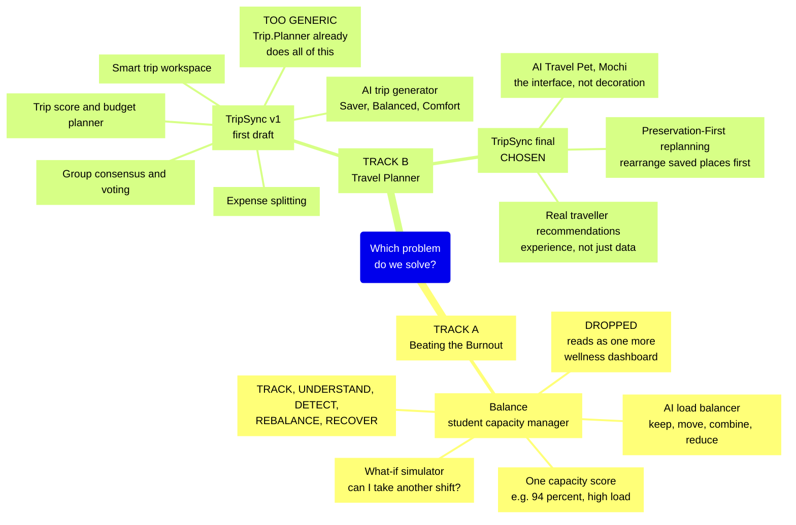

**Board 2: problem tree for the track we chose.** Root causes at the bottom, the
core problem in the middle, and what it actually does to travellers at the top.
The bottom row is what TripSync has to attack; the top row is what a judge
recognises from their own group trips.

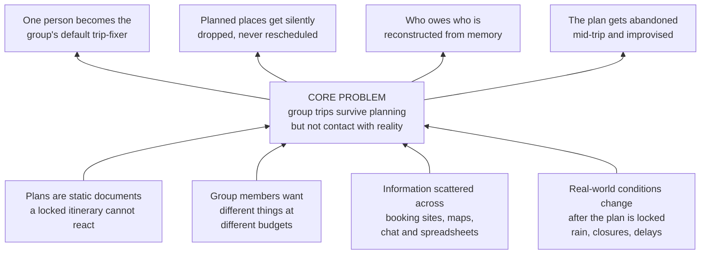

**Board 3: how the idea actually evolved.** Two pivots during ideation, each
triggered by the same question, *what here is genuinely ours?*, plus one feature
that only surfaced later while we were designing the screens. This is the diagram
that shows the reasoning rather than just the outcome.

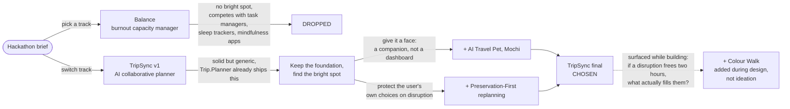

**Board 4: user flow for our differentiator.** Preservation-First replanning as
an actual decision path. The point of the diagram is the branch on the right:
suggesting somewhere new is the *last* resort, not the first move, which is the
opposite of how most planners behave.

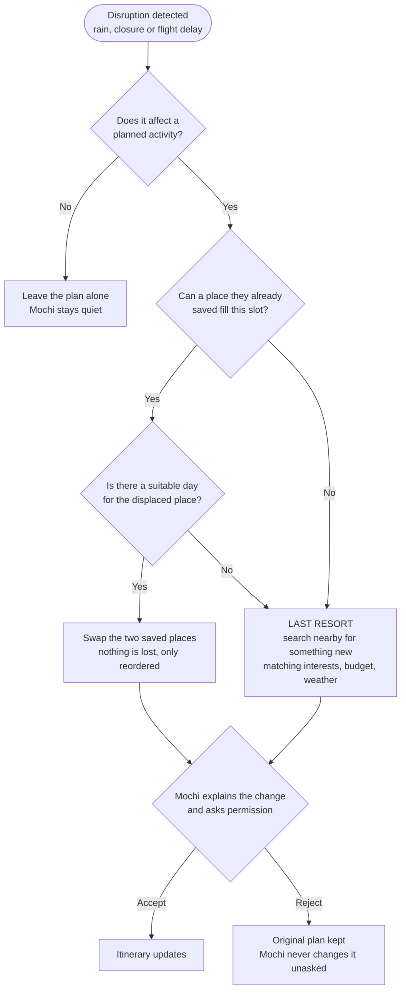

### 2.3 Mentor Consultation

| Date | Mentor | Feedback Received | What We Did |
| --- | --- | --- | --- |
| 8/9/2026 | Janelle Tan | Mochi (the pet) is a distinctive, memorable feature that genuinely sets TripSync apart from other travel apps, and it should be treated as the product's bright spot. Rather than spreading effort across many features, the team should pick the strongest one and focus on making it shine. | We stopped assuming that more features meant a stronger submission: Mochi stayed the centrepiece rather than becoming one feature among many, and we narrowed the scope rather than widening it. |
| 11/9/2026 | Janelle Tan | The UI and the existing feature set already do the job well for group trip planning. No changes were requested; the advice was to keep the current scope, polish the features we already have rather than add to them, and make sure the app flows smoothly from one step to the next. | No redirection was needed — the session confirmed the scope we set on 8/9 — so we froze the feature set and put the time into flow instead. The advice was about the flow in general rather than any specific fault, so we went looking ourselves and walked the app as a new user would. |

---

## 3. Design & Prototype

**UI Prototype:** https://trip-sync-blue.vercel.app/?demo=1

The bare link opens the app the way a new user meets it: an empty cold start offering three ways in (start a trip, paste a list you already have, or load the sample). **Add `?demo=1` to land directly in the seeded 4-person Guangzhou trip**, which is the fastest route to the replanning demo. `?view=1` opens any trip read-only, which is what a share link hands a viewer.

### How the app is organised

TripSync is not a sequence of screens you walk through once. It is **three surfaces matching the three phases of a trip**, switched from a bottom tab bar, with everything else opening as a drawer over whichever surface you are on:

| Surface | Phase | What lives there |
| --- | --- | --- |
| **Plan** | Before | The itinerary itself: day-by-day stops with real travel time between them, drag to reorder, meal gaps called out, and the trip grid across multiple cities |
| **Today** | During | The one day you are actually in, plus the disruption when there is one, Mochi's alert, and the repair |
| **Memories** | After | The retrospective: actual spend against budget, ratings, and what the trip taught TripSync about the group |

Adding places, money, group preferences, trip settings, sharing, the flight-status view and Colour Walk all open as drawers rather than navigating away, so the group never loses sight of the plan they are editing. Every panel's title and Mochi's line for it are defined in one file (`src/navigation.ts`), which is why a panel can be a page or a drawer without the screen knowing the difference.

| | |
| --- | --- |
| 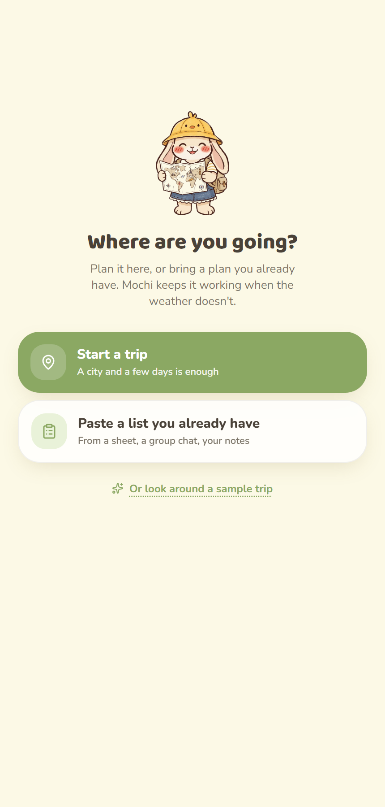 **Cold start.** No stranger's itinerary and no marketing page: start a trip, paste a list you already have, or look around the sample. | 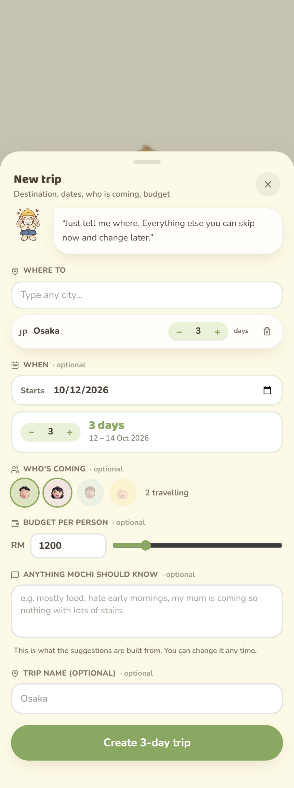 **Start a trip.** A city and a few days is enough. Pick your start date and the day labels follow it; everything else is optional and stays editable. |
| 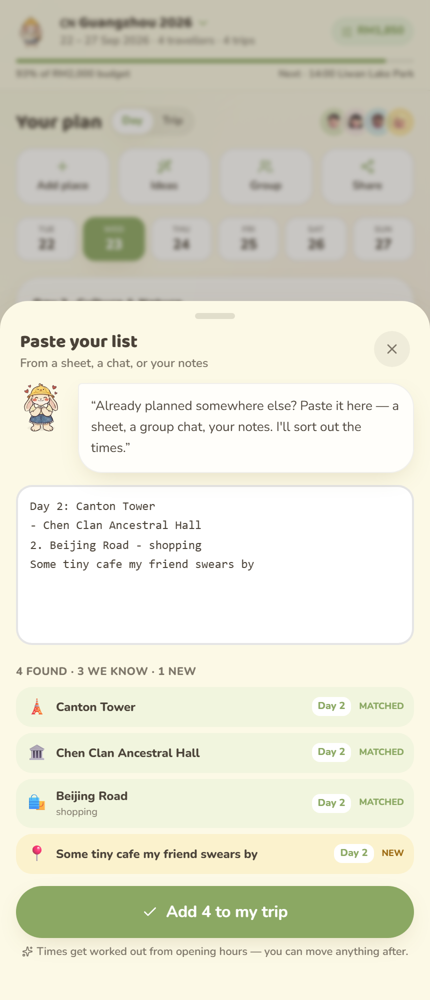 **Bring a plan you already have.** Paste from a sheet or a group chat. Day prefixes, bullets and numbering are understood, known places are matched, and anything unrecognised is kept as your own rather than dropped. | 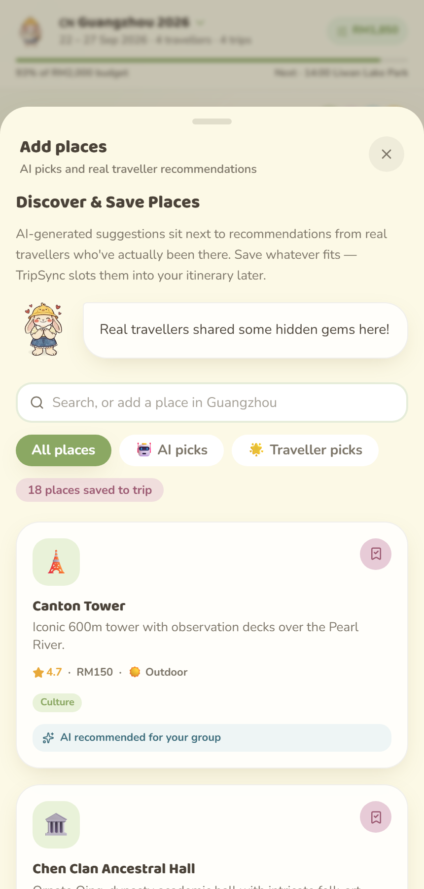 **Discover.** AI picks and real-traveller recommendations side by side, filterable, saved straight into the trip. |
| 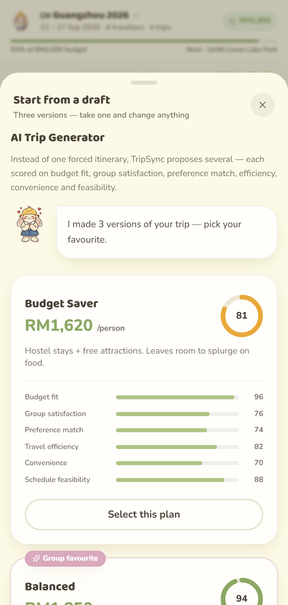 **AI-scored plans.** Three itinerary options, each transparently scored on budget fit, group satisfaction, preference match, and more. | 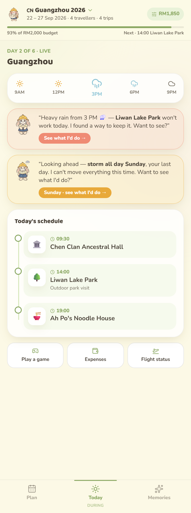 **Today.** The day you are actually in. Mochi raises what is about to go wrong — rain at 3 PM, a storm on the last day — before it costs you anything. |
| 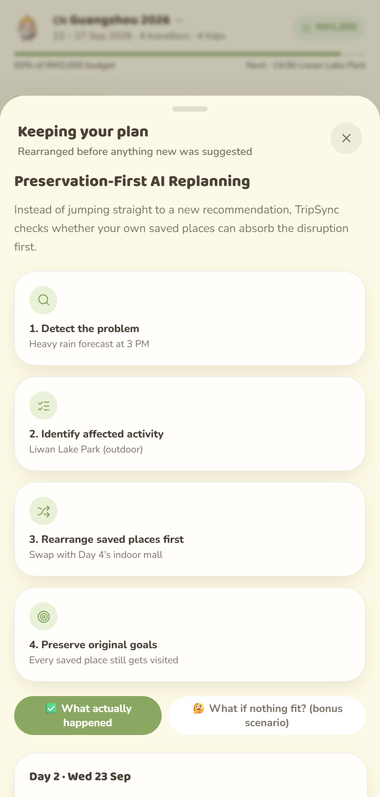 **Preservation-First replanning.** Real engine output, not a mockup: the rained-out park is reslotted earlier the same day, every other stop is untouched, and the freed window is named along with somewhere indoors that is open. | 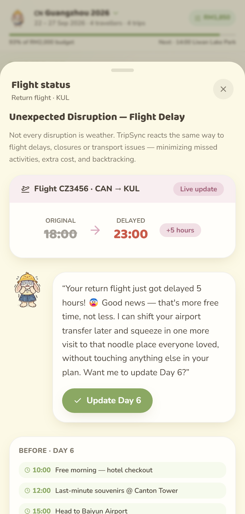 **Flight delay auto-reflow.** A 5-hour delay becomes a bonus noodle run instead of a scramble at the gate. |
| 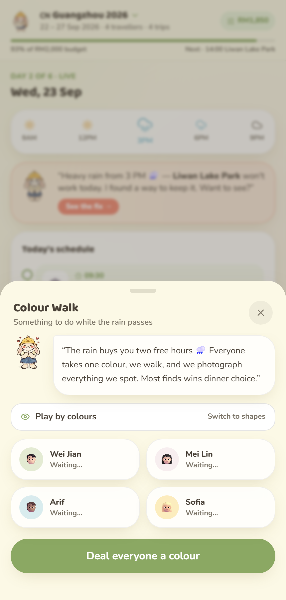 **Colour Walk.** The disruption's free two hours become a group photo scavenger hunt, with a shape-based mode for colour-blind travellers. | 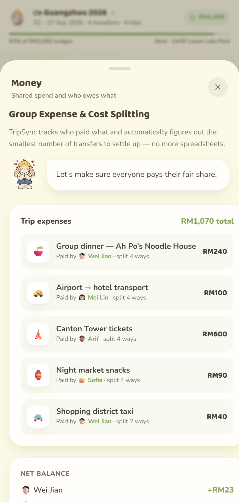 **Expense tracking.** Every shared cost logged, with the minimal set of settle-up transfers computed automatically. |
| 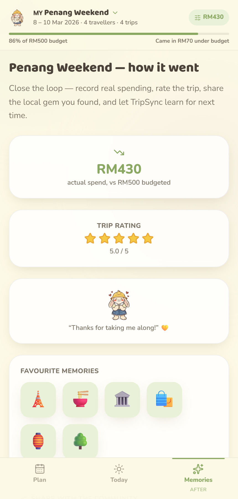 **Post-trip retrospective.** Actual spend vs. budget, a rating, shared memories, and a profile TripSync carries into the next trip. | |

---

## 4. What Makes It Different

- **Preservation-First replanning, not regeneration.** Most planners either freeze the itinerary or throw it out and regenerate from scratch after a disruption. TripSync's engine works down a deliberate ladder — **reslot** the stop later the same day, **swap** it with a stop on another day, **move** it into a free slot, and only **drop and suggest something new** when nothing else fits. A new recommendation is the last rung, never the first move, so a rained-out afternoon doesn't cost you the attraction you actually wanted to see. This is real working code in `src/engine/replan.ts`, not a scripted screen, and it is guarded by 12 self-check scenarios that run on every dev start.
- **When something must be lost, it isn't always the same person's plan.** The engine tracks who added each place and rescues stops from whoever has already lost the most, then reports per-traveller how much of each person's list survived. Fairness in a group trip is not just scoring the plan up front; it is who absorbs the damage when the day breaks.
- **A schedule that is physically possible.** Stops are timed against real door-to-door travel between them, with the mode picked by distance, and against opening hours, your arrival and departure times, and the hours a multi-city hop actually eats. Most planners will happily hand a group a day that cannot be walked.
- **A pet that notices things going wrong, not a notification.** Wanderlog and TripIt surface disruptions as banners and push alerts. TripSync's Mochi is the one surfacing the same information (rain coming, a flight delayed, an attraction closed), but as a character with a face and a reaction, not a system notification. Neither Wanderlog nor TripIt has a companion built into the product like this; it's not a cosmetic skin, it's the interface travellers actually talk to when something changes.
- **A disruption becomes an activity, not just a problem.** Colour Walk turns a scheduling gap (caused by weather, delay, or a cancelled slot) into a bonded group activity instead of dead time, with a shape-based mode built in for colour-blind travellers from day one.
- **Group-fair AI scoring, shown transparently.** Itinerary options are scored per-traveller-preference and shown as explicit scores (budget fit, group satisfaction, preference match, efficiency, convenience, feasibility) rather than a black-box "recommended for you."
- **The trip keeps learning.** The post-trip retrospective feeds a learned preference profile forward into future trips, instead of every trip starting from a blank slate.
- **Zero-friction sharing.** Anyone with the link can view the live trip with no account; only invited collaborators can edit.

*(See the comparison table in section 1 for how this stacks up against Wanderlog/TripIt feature-by-feature.)*

---

## 5. Technical Architecture & Feasibility

### Tech stack

**Built and deployed today (prototype phase):**

| Layer | Choice | Why we chose it | Constraints |
| --- | --- | --- | --- |
| Frontend | React 19 + TypeScript, Vite | Fast dev loop and strong typing for a screen-flow-heavy app; the whole team already knows React | None |
| Styling | Tailwind CSS v4 | Rapid iteration across many screens without importing a component library that would fight our own visual style | Needs discipline to keep design tokens consistent across screens |
| Motion | Framer Motion | Screen transitions and Mochi's micro-interactions, which carry a lot of the product's personality | Adds bundle size; used sparingly |
| Icons | lucide-react | Consistent icon set across the app | None |
| Linting | Oxlint | Fast, zero-config linting | None |
| Data | Local mock data (`src/data/mockData.ts`) | Lets the UI/UX prototype run fully client-side, so the demo works with zero infrastructure | No persistence, no real users, nothing survives a refresh |
| Hosting | Vercel | Free tier and zero-config for Vite: the production build is a static bundle, so a deploy is one command | Deployed from the Vercel CLI rather than on push, because the project is not Git-connected yet. That makes pushing to GitHub and publishing two separate steps, which is fine for a prototype but is the first thing we would automate. Free tier is fine for a demo, not for real traffic |

**Currently, this repository is a client-side UI/UX prototype:** all trips, places, travelers, and expenses are mock data bundled with the app. There is no backend, database, or external API integrated yet. The table below is what we will actually build on top of it.

**Planned for the building phase.** Every choice below is either genuinely open-source (Supabase, Open-Meteo, OpenStreetMap) or has a free tier that covers a student project at our scale. Limits quoted are the ones published as of September 2026.

| Layer | Choice | Why we chose it | Constraints we expect |
| --- | --- | --- | --- |
| Backend | [Supabase](https://supabase.com) (managed Postgres with auto-generated REST APIs) + Vercel Serverless Functions for anything holding a secret key | Supabase's core is open-source (Apache 2.0) and self-hostable, so a free-tier change can't strand us. As a 3-person, frontend-strong team we'd rather configure a backend than build and operate one. The serverless functions exist purely to keep LLM/weather/flight keys off the client | Free tier allows **2 active projects**, so staging and production compete for slots. Serverless request/response payloads cap at **4.5 MB**, fine for JSON itineraries |
| Database | Supabase Postgres (`trips`, `places`, `itinerary_items`, `expenses`, `travelers`, `trip_access`) | A relational DB matches what we already model: trips have days, days have places, expenses reference travelers. Row Level Security enforces view-vs-edit permissions in the database rather than trusting the client | Free tier gives **500 MB database + 1 GB file storage**, plenty for trip records but not for unlimited trip photos. Projects **pause after 1 week of inactivity** (policy tightened Feb 2026) and must be manually resumed, so we must wake it before any demo |
| Auth & sharing | Supabase Auth (anonymous sessions) + `trip_access` table with `owner`/`editor`/`viewer` roles | Makes the accountless share link real: a link resolves to a role enforced by RLS, and viewers never create an account. That is a feature we actively claim, not just a convenience | Free tier covers **50,000 monthly active users**, far beyond our needs. Anonymous sessions expire, so a returning viewer needs the share token in the URL to re-resolve access |
| Realtime *(stretch goal)* | Supabase Realtime (Postgres change feed over WebSockets) | Live group collaboration without running our own WebSocket server. Bundled with the database we are already using, so it costs us integration time rather than a new service | Realtime channels need their own RLS policies, otherwise a read-only viewer can still receive edit events. Scoped as a stretch goal because three weeks is not enough to commit to it (see Build plan below) |
| AI service | Google Gemini free tier while building; Claude Haiku or GPT-4o-mini when we need better structured output. Open-weight models (Llama/Qwen via Groq's free tier, or Ollama locally) as the fully-open fallback | The model returns scored itinerary options in the same JSON shape `mockData.ts` already uses, so the UI doesn't change when mock scores become real ones. The open-weight route means we are never blocked by a vendor's pricing decision | Every free LLM tier rate-limits per minute. Fine for a demo, would need a paid tier for concurrent real users. Structured/function-calling output quality is noticeably better on the paid models |
| Weather API | [Open-Meteo](https://open-meteo.com) | Open-source and free with **no API key at all**, which removes an entire class of setup friction. This is what makes Mochi's rain alert fire from real conditions instead of a script | Free tier is **non-commercial use only** (fine for a student project, would need their $29/mo commercial plan to ever monetise), capped at ~**10,000 calls/day, 600/minute**, and requires CC BY 4.0 attribution. Pull-based, so we poll rather than receive pushed alerts |
| Flight-status API | [AeroDataBox](https://aerodatabox.com) free tier, with [OpenSky Network](https://opensky-network.org) as the open-data fallback | AeroDataBox is purpose-built for flight status and aimed at hobby/student projects. OpenSky is community-run and genuinely open for non-commercial use, so we have a no-cost path either way | AeroDataBox free tier is **~600 API units/month**, so we poll only the group's own flights, not continuously. OpenSky is rate-limited with uneven coverage outside Europe/North America. **Note:** we originally planned to use Amadeus Self-Service here, but its developer portal was decommissioned on 17 July 2026, so it is no longer an option |
| Places data | Existing curated place data first, then [OpenStreetMap](https://www.openstreetmap.org) via the Overpass API | Fully open data (ODbL), no per-request billing and no key, enough to answer "find an indoor alternative nearby" | Sparser than Google Places: fewer photos and patchier opening hours, which matters because our replanning logic wants to know if somewhere is open. Overpass asks for polite rate-limiting, so we cache lookups |
| Hosting | Vercel (frontend + serverless functions) and Supabase Cloud (database) | Both have real free tiers and both connect to GitHub, so there is no infrastructure for a 3-person team to operate during the build phase. Connecting the repo so `main` deploys on push is a build-phase task, not something the prototype does today | Vercel's Hobby plan is **non-commercial use only**, so the moment TripSync tried to earn money we would need Pro (~$20/user/mo). Hobby functions allow up to 300s duration and 2 GB memory, well beyond what our API routes need |

**On "free and open source":** Supabase, Open-Meteo and OpenStreetMap are genuinely open-source/open-data, and Supabase can be self-hosted if we ever outgrow its free tier. Vercel, AeroDataBox and the hosted LLMs are proprietary services we are using on free tiers, so we have deliberately picked ones with an open escape hatch: Vercel can be swapped for any static host plus a small Node server, and the LLM layer can fall back to open-weight models. Two limits genuinely constrain us rather than being theoretical: Vercel Hobby and Open-Meteo's free tier both forbid commercial use, which is fine for a student prototype but would need paid plans on day one of any real launch.

### System architecture (planned)

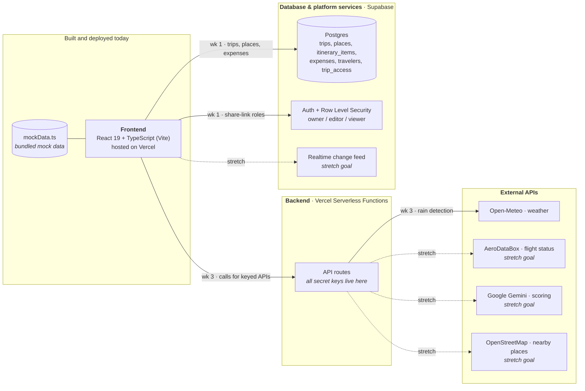

Solid arrows are committed in the three-week plan below and labelled with the week they land; dotted arrows are stretch goals we will only reach if we are ahead. Only the "Built and deployed today" box exists right now: the live demo is the frontend alone, reading from `mockData.ts`.

Note that the Preservation-First engine, our middle and most important week, has no edge on this diagram at all, because it is pure application logic. Our core differentiator needs no external service to work, which is exactly why we scheduled it where nothing outside the team can block it.

### Build plan & scope

**Our building phase is 21 September to 11 October 2026: three weeks, three people.** The plan below is scoped to fit exactly that, and ordered so the thing that makes TripSync different is built before the things that merely make it complete.

| Dates | Goal | What ships |
| --- | --- | --- |
| **21 – 27 Sep** | **Persistence and access control** | Supabase schema (`trips`, `places`, `itinerary_items`, `expenses`, `travelers`, `trip_access`) and migrate `mockData.ts` into it, so a trip survives a refresh and exists across devices. Row Level Security policies and `owner`/`editor`/`viewer` roles are written against those same tables in the same week, which also makes the accountless share link real rather than a URL parameter |
| **28 Sep – 4 Oct** | **The Preservation-First engine, for real** | Replace the scripted demo with an actual algorithm: given a disrupted activity, search the traveller's own saved places for a legal swap (indoor vs outdoor, day availability, duration, existing bookings) and only fall back to suggesting somewhere new when nothing saved fits. This is our differentiator, and it is pure application logic with no external dependency, so nothing outside the team can block it |
| **5 – 11 Oct** | **Live weather signal, then freeze** | Open-Meteo polled behind a serverless function, so Mochi's rain alert fires from real conditions instead of a script. Then we stop building: the last stretch is reserved for bug-fixing, a deploy freeze, and demo rehearsal |

**Stretch goals, only if we are ahead of schedule.** These are genuinely optional, not quietly assumed:

- **Realtime sync** (Supabase Realtime subscriptions), so two travellers see each other's edits live rather than on refresh.
- **AeroDataBox flight status**, extending live disruption detection beyond weather.
- **LLM-scored itineraries**, replacing our rules-based scoring with a real model call.
- **OpenStreetMap place lookup**, so the engine's last-resort branch can suggest a real nearby alternative. Until then that branch draws from our existing curated place list, which is enough to demonstrate the behaviour.

**What we cut first if we fall behind.** Naming this up front is part of the plan, not an admission of failure:

1. **The stretch goals above go first**, in that order, since none of them are load-bearing.
2. **Then the live weather call, keeping the engine.** The Preservation-First engine can be triggered by a manually-entered "it's raining at 3pm" during the demo. A real weather feed is what makes it automatic, not what makes it work.
3. **Persistence is the last thing we would ever cut.** A trip that vanishes on refresh is not a product.

Notably, the middle week is not on that list. If everything else slipped and we shipped only the first two weeks, TripSync would still be the thing we claim it is: a planner that protects your existing plan when the day goes wrong.

**Deliberately out of scope** for these three weeks: native mobile apps, payment processing for expense settlement (we compute who-owes-who, we do not move money), booking or ticketing integrations, and multi-language support.

**Resource & time awareness.** Three weeks (21 Sep to 11 Oct) across three frontend-strong people (React, Tailwind), working alongside coursework, is roughly nine person-weeks of part-time capacity, and that is the single hardest constraint on this plan. It is why we lean on managed services rather than infrastructure we would have to build and operate: Supabase gives us database, auth and realtime as configuration instead of three separate weeks of backend work, which is most of our budget gone if we wrote it ourselves. It is also why realtime collaboration sits in the stretch list rather than the committed weeks: it is the one planned capability that Wanderlog already does well, so we would rather spend our scarce weeks on the thing nobody else does and ship refresh-based syncing than demo a half-working live cursor. The hackathon submission itself was deliberately frontend-only for the same reason, so all three of us could spend the time on UI/UX and the demo rather than on plumbing a judge cannot see. The two real risks we are watching are the Supabase free tier pausing after a week of inactivity (we wake it before any demo) and the free API rate limits above, which is why every external call is polled on a schedule and cached rather than requested per page view.

